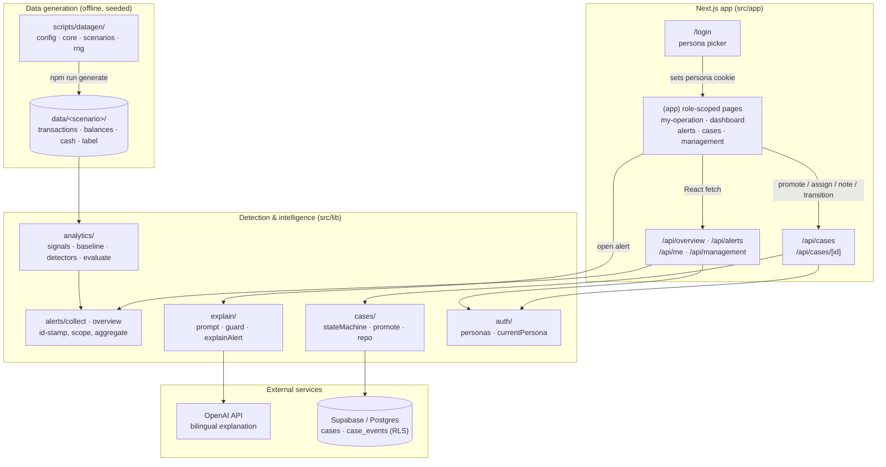

# Architecture

SALRIP (product name **Vault**) is a Next.js 16 (App Router) application with three
grounded backend capabilities — a **detection engine**, a **bilingual explainer**, and a
**case coordination workflow** — a synthetic **data generator** that makes the whole thing
measurable, and a **role-based console** that shows each of the problem statement's
stakeholders a scoped slice of the operation. This document maps the *real* modules and
data paths in the repo.

## System data flow

Every arrow below is wired and exercised today. The read endpoints
(`/api/overview`, `/api/alerts`, `/api/me`, `/api/management`) serve live analytics output;
the case endpoints persist to Supabase.



**Reading the diagram in one sentence:** synthetic datasets feed a deterministic detection
engine; `collect`/`overview` id-stamp, scope, and aggregate its output; the signed-in
**persona** (a cookie read by `currentPersona()`) decides which slice each read endpoint
returns; and the only *stateful, multi-user* data — the human coordination workflow — is
written through `/api/cases` into Supabase with an immutable audit trail.

## What is analytics vs. what is the database

This split is deliberate and answers "what does the DB actually do here":

- **Analytics is read-only.** Balances, cash, transactions, alerts, forecasts, and every
  dashboard number are *computed on each request* from the seeded synthetic datasets in
  `data/`. Nothing is written back — the rulebook wants synthetic, reproducible data and
  **no real financial transactions**, so there is nothing to mutate here.
- **The database is the system of record for human decisions.** Supabase holds the two
  tables that *change over time and are shared between roles*: `cases` and `case_events`.
  Promoting an alert **inserts** a case; assigning, acknowledging, escalating, resolving,
  and **adding a free-text note** each **update** the case and **append** an immutable
  `case_events` row. The Case Board and its history view read that state back. That is the
  app's live input → persist → reflect loop.

## Access & roles

There is **no password/credential collection** (a hard guardrail). `/login` is a persona
picker: choosing a demo user sets a `vault_persona` cookie, and the whole console
re-scopes.

| Role | Lands on | Sees | May do |
|---|---|---|---|
| **Super Agent** | `/my-operation` | Only their own float per provider, shared cash, their alerts + a plain-language bilingual advisory | Read-only |
| **Ops Coordinator** | `/dashboard` | Full portfolio, all alerts, Case Board | Promote, assign, acknowledge, escalate, resolve |
| **Risk & Compliance** | `/alerts` | All alerts + Case Board | Acknowledge, escalate, add notes — **not** assign or resolve (no final call) |
| **Management** | `/management` | Area-level rollup: risk by area, recurring problems, readiness | Read-only |

Scoping is enforced **server-side**: `currentPersona()` (reads the cookie via
`next/headers`) is called inside the route handlers, so an agent's `/api/alerts` returns
only their signals and `/api/alerts/[id]` returns **404** for another agent's alert. The
client `PersonaProvider` + `useRoleGuard` handle navigation and per-role affordances (e.g.
hiding the promote panel, restricting the analyst's case actions).

## Request/runtime paths

### 1. Detection (offline, verified) — `npm run analyze`

```
data/<scenario>/*.json
  → src/lib/analytics/data.ts        load + shape into a Dataset
  → src/lib/analytics/detectors.ts   analyze(ds) = fraud + drain + stale + shared-cash
        ├─ signals.ts   Poisson survival velocity, dominant-cluster isolation, concentration
        └─ baseline.ts  per-agent/hour Poisson baseline + population fallback (new agents)
  → src/lib/analytics/evaluate.ts    compare alerts to ground-truth labels → recall/FPR
  → scripts/analyze.ts               print the results table + summary
```

The engine is **pure and dependency-free** (no ML/stats libraries): everything is explicit
arithmetic, which is what makes each alert's evidence auditable.

### 2. Console reads (live over HTTP) — `/api/overview`, `/api/alerts`, `/api/me`, `/api/management`

```
src/lib/alerts/collect.ts   collectAlerts(): analyze() over every scenario, deduped,
                            id-stamped (opaque hash), severity-sorted
src/lib/overview.ts         buildOverview()  → portfolio: float, shared cash, forecasts,
                                               per-provider reduced-confidence + shared-cash risk
                            agentOverview(id) → one agent's float/cash/alerts + advisory inputs
                            managementOverview() → per-area rollup of signals + recurring types
  → the route handler calls currentPersona() and scopes the result to the role
```

### 3. Explanation (offline harness; live call optional) — alert detail + `npm run explain`

```
DetectionAlert
  → src/lib/explain/prompt.ts        buildUserPrompt() with a NEUTRAL_DESCRIPTOR
        (the raw type name, e.g. "FRAUD_BURST", is never sent to the model)
  → src/lib/explain/explain.ts       OpenAI chat completion, strict JSON schema
        → OpenAI API                 returns { title, english, bangla, recommendedAction }
  → assertNoForbiddenWords()         post-generation guard rejects any "fraud" (any language)
```

The alert detail page renders this bilingually and degrades gracefully if the key is unset.
The **agent-facing advisory** on `/my-operation` is a separate, *deterministic* bilingual
message (`agentAdvisory()` in `display.ts`) so the agent view never depends on a live call.

### 4. Case coordination (live over HTTP) — `/api/cases`

```
Console / client (sends alert ID or requested transition; never supplies actor)
  → POST /api/cases                  resolve engine alert ID → Case (Open)
  → PATCH /api/cases/[id]            reassign, transition status, and/or attach a note
        → src/lib/auth/server.ts     derive persona + role server-side; deny forbidden actions
        → src/lib/cases/promote.ts   caseFromAlert(): SLA by severity (HIGH 4h / MED 12h / LOW 24h)
        → src/lib/cases/stateMachine.ts  validate transition (illegal move → 409)
        → src/lib/cases/repo.ts      update case + append immutable case_events row (actor + note)
        → src/lib/supabase/server.ts service-role client (bypasses RLS)
        → Supabase Postgres          cases + case_events (enum, trigger, RLS deny-all)
```

The state machine is the safety spine of the workflow:

```
Open ──▶ Assigned ──▶ Acknowledged ──┬─▶ Resolved
                  └──▶ Escalated ◀───┘   (Escalated ⇄ Acknowledged; Resolved is terminal)
```

Every transition, reassignment, and note writes an append-only `case_events` audit row, so
a case's full history — who touched it, when, from/to status, and their note — is
reconstructable in the Case Board's history view. That provenance is the traceability a
reviewer needs.

## Module responsibilities

| Module | Responsibility | Key files |
|---|---|---|
| `scripts/datagen/` | Seeded, reproducible synthetic world (agents, Poisson traffic, injected scenarios, ground-truth labels) | `config.ts`, `core.ts`, `scenarios.ts`, `rng.ts` |
| `src/lib/analytics/` | Deterministic detectors + eval harness | `signals.ts`, `baseline.ts`, `detectors.ts`, `evaluate.ts` |
| `src/lib/alerts/collect.ts` | Run the engine over all scenarios; dedupe + id-stamp into an `AlertView` feed | `collect.ts` |
| `src/lib/overview.ts` | Portfolio / agent / management aggregations for the read endpoints | `overview.ts` |
| `src/lib/explain/` | Bilingual, review-oriented explanation + hard no-"fraud" guard | `prompt.ts`, `explain.ts` |
| `src/lib/cases/` | Case lifecycle: promote → state machine → persistence + audit | `promote.ts`, `stateMachine.ts`, `repo.ts`, `types.ts` |
| `src/lib/auth/` | Personas, role definitions, and the server-side `currentPersona()` cookie reader | `personas.ts`, `server.ts` |
| `src/lib/supabase/` | Server-only Supabase client (service-role) | `server.ts` |
| `src/lib/display.ts` | Presentation layer: neutral labels, formatters, confidence, area, agent advisory | `display.ts` |
| `src/app/(app)/` | Role-scoped console pages (my-operation, dashboard, alerts, cases, management) | `*/page.tsx`, `layout.tsx` |
| `src/app/login/` | Persona picker (no credentials) | `page.tsx` |
| `src/app/api/` | Route Handlers: scoped reads (`overview`, `alerts`, `me`, `management`) + case workflow | `*/route.ts` |

## Key design boundaries

- **Two liquidity models are kept separate.** Per-provider **e-float** (drives
  `LIQUIDITY_DRAIN`) and the single **shared physical cash pool** (drives
  `SHARED_CASH_SHORTAGE`) are modelled and detected independently. Provider balances are
  never merged into one number — that separation is both a correctness requirement and a
  responsible-design guarantee (see [RESPONSIBLE_DESIGN.md](./RESPONSIBLE_DESIGN.md)).
- **Provider boundaries are enforced by role.** An agent only ever sees their own data;
  the scoping runs in the route handler, not just the UI.
- **The type name never reaches the model.** The explainer sends a neutral behavioural
  descriptor, not `"FRAUD_BURST"`, and a post-generation guard is the backstop.
- **Cases are server-authored and role-authorised.** RLS denies direct client access;
  handlers derive the audit actor from the persona cookie, enforce coordinator/analyst
  permissions, and resolve alert evidence from an engine-owned ID before using the
  service-role key.
- **Reliability is visible, not silent.** A stale/conflicting feed marks the affected
  balance ("Feed delayed") and any promoted alert carries a reduced-confidence banner, so
  degraded data never reads as a confident conclusion.
- **TypeScript runs unbuilt for data work.** `analyze`/`generate`/`explain` use Node's
  native `--experimental-strip-types`, so the analytics path has no build step.

## Detector summary

| Detector | Fires on | Core signal(s) | Evidence surfaced |
|---|---|---|---|
| `detectFraud` | Structured burst | Poisson-velocity **AND** low amount-CV **AND** counterparty concentration, all measured on the *isolated* near-identical sub-cluster | peak vs expected velocity, cluster size, cluster CV, unique customers |
| `detectLiquidityDrain` | Per-provider float decline | ≥20% fall in **daily-opening** float over 7 days + aggregate-masking check | opening-decline %, start/end opening, depletion ETA, masked-by-aggregate |
| `detectStaleFeed` | Frozen/broken feed | Repeated non-advancing balance snapshots **while** transactions keep posting | frozen-snapshot count, tx-during-freeze, conflict flag |
| `detectSharedCashShortage` | Cross-provider cash crunch | Multi-provider simultaneous cash-out demand ≥80% of shared cash on hand | combined demand, available cash, margin (BDT), demand-vs-cash %, providers |

Thresholds, the "all-three" fraud rule, and why the looser OR-rule was rejected are
documented in [DATA_AND_ASSUMPTIONS.md](./DATA_AND_ASSUMPTIONS.md).
